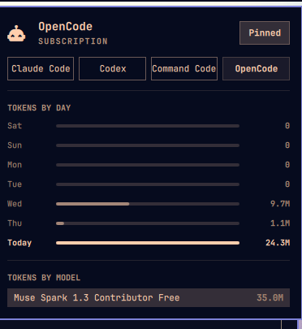

# OpenCode Usage for Omarchy

Shows OpenCode usage in the Omarchy agents panel, following the pattern of
[`wellatleastitried/omarchy-copilot-panel-usage`](https://github.com/wellatleastitried/omarchy-copilot-panel-usage)
and
[`jhonoryza/omarchy-commandcode-usage`](https://github.com/jhonoryza/omarchy-commandcode-usage).



## How it works

- `bin/omarchy-agent-usage-opencode` reads the SQLite database at
  `~/.local/share/opencode/opencode.db` (table `message`, JSON payloads in
  the `data` column), tallies prompts and tokens per day and per model, and
  writes `~/.local/state/omarchy/agents/usage/opencode.json`. The database
  is only ever opened read-only.
- `ui/main.qml` runs the collector every 5 minutes and whenever the usage
  directory changes.
- The agents panel picks up the new tab automatically once the JSON record
  exists. Nothing under `/usr/share/omarchy` is touched.

## Install

```bash
omarchy plugin add https://github.com/jhonoryza/omarchy-opencode-usage.git --enable
```

## Removal

```bash
omarchy plugin remove dell.opencode-usage
```

## Manual test

```bash
~/.config/omarchy/plugins/dell.opencode-usage/bin/omarchy-agent-usage-opencode | head -n 40
~/.config/omarchy/plugins/dell.opencode-usage/bin/omarchy-agent-usage-opencode --write
omarchy plugin validate ~/.config/omarchy/plugins/dell.opencode-usage
omarchy-shell shell rescanPlugins
```

## Notes

- OpenCode exposes no quota endpoint, so `limits` stays empty — what you
  get is local stats: today, the last 7 days, and all-time totals per model.
- The panel resolves provider icons from the *agents* plugin's `assets/`
  directory, so a custom `opencode.svg` belongs there (see
  [omarchy-agents-pin](https://github.com/jhonoryza/omarchy-agents-pin)),
  not in this repo. Without one the panel falls back to its default glyph.

## Dependencies

- Python 3 (standard library only, no extra packages).
- OpenCode sessions in `~/.local/share/opencode/opencode.db` (respects
  `XDG_DATA_HOME` if set), opened read-only. Nothing is written outside
  `~/.local/state/omarchy/agents/usage/`.

## License

MIT
